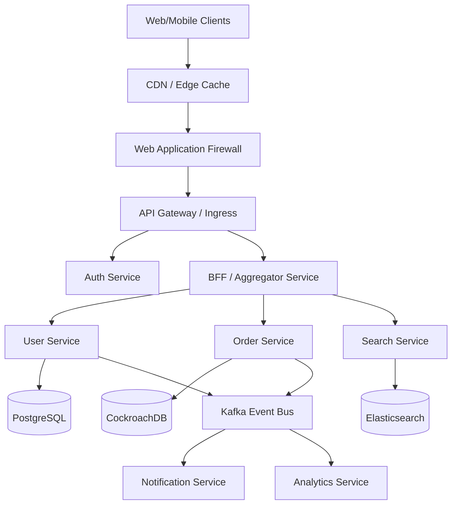

# BACKEND_ARCHITECTURE.md

## 1. Executive Summary

### Purpose of System
This document outlines the architecture for a modern, highly scalable, and resilient backend system designed to support millions of concurrent users, handle high-throughput transactional data, and provide sub-second latency for API requests.

### Business Goals
- **Global Reach:** Serve a global user base with minimal latency.
- **High Availability:** Achieve 99.999% (Five Nines) uptime.
- **Rapid Feature Delivery:** Enable autonomous teams to build, test, and deploy services independently.
- **Data Security:** Ensure military-grade security for PII and sensitive transactional data.

### High-Level Architecture Overview
The system employs a microservices architecture running on a managed Kubernetes cluster (EKS/GKE), utilizing an API Gateway for edge routing, an event-driven backbone (Apache Kafka) for asynchronous inter-service communication, and a polyglot persistence strategy optimized for specific access patterns.

### Key Technical Objectives & SLAs
- **Scalability Targets:** 100,000 requests per second (RPS) peak load.
- **Latency:** 95th percentile (p95) < 100ms for read operations; p95 < 250ms for write operations.
- **Reliability:** RPO (Recovery Point Objective) < 5 minutes; RTO (Recovery Time Objective) < 15 minutes.
- **Security:** Zero Trust network architecture, mTLS between all services, at-rest and in-transit encryption.

---

## 2. System Overview

### Functional Requirements
- User authentication and session management.
- Real-time data processing and analytics.
- Transactional integrity for core operations.
- Asynchronous notification and webhook delivery.

### Non-Functional Requirements
- **Scalability:** Auto-scaling compute and storage layers.
- **Maintainability:** Standardized logging, distributed tracing, and metrics.
- **Resiliency:** Circuit breakers, retries with exponential backoff, and fallback mechanisms.

### Architecture Style: Microservices vs Monolith
A microservices approach was selected over a monolith due to the need for independent scaling of heavily utilized components (e.g., search vs. user profiles), isolated failure domains, and polyglot technology choices (e.g., Go for high-throughput network services, Python for ML/data processing, Node.js/TypeScript for API aggregation).

---

## 3. High-Level Architecture



### Control Plane vs Data Plane
- **Data Plane:** Handles the actual execution of requests, API traffic, and data processing.
- **Control Plane:** Manages configuration, service discovery, rate limiting rules, and security policies (e.g., Istio Control Plane).

---

## 4. Infrastructure Architecture

### Cloud Provider & Topology
- **Multi-Region Active-Active:** Deployed across AWS us-east-1 and eu-west-1.
- **VPC Design:** 
  - **Public Subnets:** NAT Gateways, ALB/NLB.
  - **Private Subnets:** Kubernetes Worker Nodes, Application Services.
  - **Isolated Subnets:** Databases, Caches, Kafka clusters.

### Edge Routing & Load Balancing
- **CDN:** Cloudflare or AWS CloudFront for static asset delivery and edge caching.
- **Load Balancers:** AWS Application Load Balancers (ALB) route traffic to the Kubernetes Ingress controller.

---

## 5. Backend Services Architecture

### Service Characteristics
- **Statelessness:** Services maintain no local state. State is delegated to distributed caches (Redis) or persistent storage.
- **Resiliency Patterns:** 
  - Implementation of Circuit Breakers (via Resilience4j or Istio).
  - Bulkhead pattern to isolate resource exhaustion.

### Example: Order Service
- **Responsibilities:** Manage order lifecycle, inventory reservation, payment initiation.
- **Dependencies:** Inventory Service (sync gRPC), Payment Service (async via Kafka).
- **Scaling Strategy:** CPU and Memory-based HPA, scaling from 5 to 100 pods.

---

## 6. API Architecture

### Protocols
- **REST:** For CRUD-heavy, standard web/mobile interactions.
- **GraphQL:** For BFF (Backend-for-Frontend) aggregation, allowing clients to specify required data fields to prevent over-fetching.
- **gRPC:** Strictly for internal service-to-service communication requiring low latency and high throughput.

### API Gateway
- **Responsibilities:** Request routing, SSL termination, rate limiting (Token Bucket algorithm), IP whitelisting, and JWT validation.

### API Flows and Inputs

#### 1. User Registration Flow (REST)
- **Flow:** Client -> API Gateway -> User Service -> PostgreSQL -> Kafka (UserCreated Event) -> Notification Service
- **Endpoint:** `POST /api/v1/users/register`
- **Inputs:**
  - `email` (string, required, format: email)
  - `password` (string, required, minLength: 12)
  - `full_name` (string, required)
  - `phone_number` (string, optional)

#### 2. Create Order Flow (GraphQL)
- **Flow:** Client -> API Gateway -> Aggregator (BFF) -> Order Service -> CockroachDB -> Kafka (OrderPlaced Event)
- **Mutation:** `createOrder(input: CreateOrderInput!)`
- **Inputs (`CreateOrderInput`):**
  - `user_id` (UUID, required)
  - `items` (Array of objects, required):
    - `product_id` (UUID, required)
    - `quantity` (Int, required)
  - `shipping_address_id` (UUID, required)
  - `payment_method_id` (UUID, required)

#### 3. Search Products Flow (REST)
- **Flow:** Client -> API Gateway -> Search Service -> Elasticsearch
- **Endpoint:** `GET /api/v1/search/products`
- **Inputs (Query Parameters):**
  - `q` (string, required): Search query
  - `category` (string, optional)
  - `price_min` (decimal, optional)
  - `price_max` (decimal, optional)
  - `page` (int, default: 1)
  - `limit` (int, default: 20)

---

## 7. Authentication & Authorization

### Flow
- **OIDC/OAuth2:** Used for user authentication.
- **JWT:** Short-lived access tokens (15m TTL) and long-lived refresh tokens (7d TTL).
- **Zero Trust & mTLS:** Every service verifies the identity of the calling service via certificates issued by the service mesh (SPIFFE/SPIRE).

---

## 8. Database Architecture

### Polyglot Persistence
- **Relational (PostgreSQL):** For highly structured data with complex relationships (User profiles, configurations).
- **Distributed SQL (CockroachDB/Spanner):** For globally consistent transactional data (Ledger, Orders).
- **NoSQL (DynamoDB/MongoDB):** For high-velocity, flexible schema data (Activity logs, session stores).

### Core Database Schemas

#### PostgreSQL (User & Catalog Data)
| Table Name | Description | Key Columns (Type) |
|------------|-------------|--------------------|
| `users` | Primary user identity | `id` (UUID, PK), `email` (VARCHAR, Unique), `password_hash` (VARCHAR), `status` (VARCHAR), `created_at` (TIMESTAMP) |
| `user_profiles` | Additional user details | `user_id` (UUID, PK/FK), `full_name` (VARCHAR), `phone` (VARCHAR), `avatar_url` (VARCHAR) |
| `products` | Product catalog | `id` (UUID, PK), `sku` (VARCHAR, Unique), `name` (VARCHAR), `description` (TEXT), `base_price` (DECIMAL), `category_id` (UUID, FK) |
| `categories` | Product categories | `id` (UUID, PK), `name` (VARCHAR), `parent_id` (UUID, FK), `slug` (VARCHAR) |

#### CockroachDB (Transactional Data)
| Table Name | Description | Key Columns (Type) |
|------------|-------------|--------------------|
| `orders` | Core order records | `id` (UUID, PK), `user_id` (UUID), `total_amount` (DECIMAL), `status` (VARCHAR), `created_at` (TIMESTAMP) |
| `order_items` | Line items for orders | `id` (UUID, PK), `order_id` (UUID, FK), `product_id` (UUID), `quantity` (INT), `unit_price` (DECIMAL) |
| `payments` | Payment ledger | `id` (UUID, PK), `order_id` (UUID, FK), `amount` (DECIMAL), `currency` (VARCHAR), `gateway_tx_id` (VARCHAR), `status` (VARCHAR) |
| `inventory_ledger` | Stock movements | `id` (UUID, PK), `product_id` (UUID), `quantity_change` (INT), `reason` (VARCHAR), `timestamp` (TIMESTAMP) |

#### DynamoDB (NoSQL Data)
| Table Name | Description | Partition Key | Sort Key | Other Attributes |
|------------|-------------|---------------|----------|------------------|
| `user_sessions` | Active auth sessions | `session_id` (String) | N/A | `user_id`, `expires_at`, `ip_address`, `user_agent` |
| `activity_logs` | Audit and action logs | `user_id` (String) | `timestamp` (Number)| `action_type`, `metadata` (JSON), `status` |

### Data Consistency
- **CAP Theorem:** We prioritize Availability and Partition Tolerance (AP) for non-critical systems, relying on Eventual Consistency. Core financial transactions utilize CP systems with two-phase commits or distributed consensus (Raft).

---

## 9. Caching Strategy

### Tiers
1. **Edge Cache (CDN):** Static assets and public, immutable API responses.
2. **API Gateway Cache:** Short-term caching for heavy read endpoints.
3. **Distributed Cache (Redis Cluster):** 
   - **Strategy:** Read-through and Write-around.
   - **Invalidation:** TTL-based and event-driven cache purging via Kafka listeners.

---

## 10. Messaging & Event Streaming

### Apache Kafka Backbone
- **Topics:** Partitioned by aggregate ID (e.g., `user_id`, `order_id`) to guarantee strict ordering within a partition.
- **Semantics:** At-least-once delivery.
- **Idempotency:** All consumers must implement idempotent processing using unique event IDs and database constraints.
- **Dead Letter Queues (DLQ):** Failed messages are routed to a DLQ for manual inspection and replay.

---

## 11. Distributed Systems Patterns

### Saga Pattern (Choreography vs Orchestration)
Used for distributed transactions across microservices.
- **Orchestration:** Centralized coordinator manages the saga lifecycle and executes compensating transactions on failure (preferred for complex workflows).

### Outbox Pattern
Ensures atomicity between database writes and event publishing. Changes are written to an `outbox` table in the same transaction as the business entity, and a separate CDC (Change Data Capture) process (e.g., Debezium) publishes them to Kafka.

---

## 12. Kubernetes & Container Architecture

### Cluster Design
- **Orchestration:** Managed Kubernetes (EKS/GKE).
- **Service Mesh:** Istio for traffic management, mTLS, and telemetry injection.
- **Workloads:**
  - `Deployments` for stateless services.
  - `StatefulSets` for stateful services (e.g., Redis, ElasticSearch if self-hosted).
  - `DaemonSets` for log agents (FluentBit) and monitoring agents (Node Exporter).

---

## 13. CI/CD & Release Engineering

### Pipeline Architecture
- **GitOps:** ArgoCD ensures the cluster state matches the Git repository state.
- **Deployment Strategies:**
  - **Canary:** Route 5% of traffic to the new version. Monitor error rates and latency. Auto-rollback if SLOs are breached.
  - **Feature Flags:** Decouple deployment from release (LaunchDarkly or Unleash).

---

## 14. Infrastructure as Code (IaC)

- **Tooling:** Terraform for cloud resources (VPC, IAM, RDS), Helm for Kubernetes packaging.
- **State Management:** Terraform state stored in S3 with DynamoDB locking.
- **Drift Detection:** Automated daily runs to detect manual infrastructure changes.

---

## 15. Observability & Monitoring

### The Three Pillars
1. **Metrics:** Prometheus for scraping, Grafana for visualization.
2. **Logs:** Structured JSON logging, ingested via FluentBit into ELK (Elasticsearch, Logstash, Kibana) or Loki.
3. **Tracing:** OpenTelemetry SDKs in all services, emitting spans to Jaeger or Honeycomb. Context propagation via HTTP headers (e.g., W3C Trace Context).

---

## 16. Reliability Engineering

- **Chaos Engineering:** Scheduled runs of Chaos Mesh to randomly terminate pods, inject network latency, and test failover mechanisms.
- **Rate Limiting & Load Shedding:** Protect backend services from thundering herds by shedding low-priority traffic at the API Gateway.

---

## 17. Security Architecture

- **WAF:** Protects against OWASP Top 10 (SQLi, XSS).
- **Secrets Management:** HashiCorp Vault. No secrets stored in code or CI/CD env vars. Pods authenticate with Vault via Kubernetes Service Accounts.
- **Encryption:** AES-256 for data at rest. TLS 1.3 for data in transit.

---

## 18. Performance Engineering

- **Database Optimization:** Strict indexing, query plan analysis, avoiding N+1 queries.
- **Connection Pooling:** PgBouncer for PostgreSQL to prevent connection exhaustion.
- **Profiling:** Continuous profiling via tools like Pyroscope to identify CPU/Memory bottlenecks in production code.

---

## 19. Scalability Engineering

- **Stateless Compute:** Pods can be destroyed and created rapidly.
- **Database Sharding:** When single-node write limits are reached, databases are horizontally partitioned based on a shard key (e.g., region or modulo of tenant ID).

---

## 20. Cost Optimization

- **Compute:** Utilize Spot Instances for non-critical, interruptible workloads (e.g., background batch processing).
- **Storage:** Lifecycle policies on S3 to move old backups to Glacier.
- **Autoscaling:** Aggressive downscaling during off-peak hours.

---

## 21. Testing Strategy

- **Unit Testing:** >80% coverage.
- **Integration Testing:** Testcontainers used to spin up real DB/Kafka instances during CI.
- **Contract Testing:** Pact framework to ensure API consumers and providers remain compatible.

---

## 22. Operational Excellence

- **Runbooks:** Executable runbooks stored in Git for every service.
- **On-Call:** PagerDuty integration with predefined escalation policies.
- **Postmortems:** Blameless postmortems mandated for any SEV-1 or SEV-2 incident.

---

## 23. Compliance & Governance

- **Data Privacy:** PII data is tokenized/encrypted before storage (GDPR/CCPA compliance).
- **Audit Trails:** Immutable audit logs for all administrative actions and sensitive data access.

---

## 24. Developer Experience (DevEx)

- **Local Development:** Devcontainers and Docker Compose files to spin up the entire stack locally in under 5 minutes.
- **IDP (Internal Developer Platform):** Backstage.io implemented to provide a single pane of glass for service catalogs, API documentation, and scaffolding templates.

---

## 25. Technical Debt & Maintainability

- **ADRs (Architecture Decision Records):** Stored in `docs/architecture/decisions/` to track *why* specific technologies or patterns were chosen.
- **Dependency Updates:** Automated via Dependabot/Renovate.

---

## 26. Future Roadmap

- **Multi-Cloud:** Abstracting cloud-specific services to support a hybrid AWS/GCP deployment.
- **Serverless Evolution:** Migrating spiky, low-latency background jobs from Kubernetes to AWS Lambda / GCP Cloud Functions to reduce idle costs.
- **AI Integration:** Implementing vector databases (Milvus/Pinecone) to support LLM-driven semantic search capabilities.

---

## 27. Appendix

### Sample Kubernetes HPA Configuration
```yaml
apiVersion: autoscaling/v2
kind: HorizontalPodAutoscaler
metadata:
  name: order-service-hpal
spec:
  scaleTargetRef:
    apiVersion: apps/v1
    kind: Deployment
    name: order-service
  minReplicas: 3
  maxReplicas: 50
  metrics:
  - type: Resource
    resource:
      name: cpu
      target:
        type: Utilization
        averageUtilization: 70
```

### Acronyms
- **BFF:** Backend For Frontend
- **CDC:** Change Data Capture
- **DLQ:** Dead Letter Queue
- **IaC:** Infrastructure as Code
- **mTLS:** Mutual Transport Layer Security
- **SLO:** Service Level Objective
